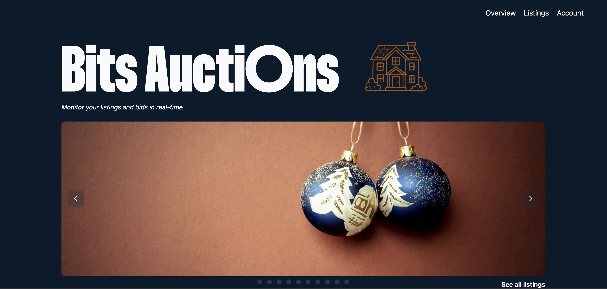

# Bits Action House

**Author:** Tele Caster Nilsen<br/>
**Website:** [www.telecasternilsen.com](https://telecasternilsen.com)

---


**Live site:** [bits-auctions](https://telecasternilsen.com/bits-auctions/)

**Description**<br/>
A modular Auction house site where users can manage and display items (listings) for auction and view charts with stats. The codebase is set up for scalability, using a clear folder structure and helper utilities. <br/>

Each listing page includes a media gallery (image carousel) when there is multiple images available, allowing users to browse images of the items without leaving the page.

---

### Table of contents

- [Technologies](#technologies-and-tools)
- [Get started](#get-started)
- [Workflow and Testing](#workflow-and-testing)
- [.env](#environment-variables)
- [Github project](https://github.com/users/telecasteren/projects/3)
- [Acknowledgements](#acknowledgements)
- [Resources](#resources)

---

## Project Structure

```
src/
  app/
    script.ts
    components/
      navbar/
    events/
    ui/
      features/
  assets/
    Typography/
  services/
    api/
    helpers/
    types/
  utils/
    config/
    storage/
    tests/
```

### Technologies and tools

- Typescript
- Tailwind
- Vite
- Husky
- Vitest
- Playwright

### Get started

#### Dependencies and setup

1. **Clone the repository**

   ```bash
   git clone https://github.com/telecasteren/bits-auctions.git
   cd bits-auctions
   git switch dev # or stay at main branch if only viewing latest
   ```

   All work happens at the dev branch/feature branches, then gets pulled into main when approved.

2. **Install dependencies**

   ```bash
   npm install
   ```

3. **Run the project**
   ```bash
   npm run dev
   ```

---

**!Note!**<br/>
If you add any libraries that require type definitions, install them using:

```bash
npm install --save-dev @types/<library>
```

---

### Workflow and testing

#### Workflow

This site is deployed with Github Pages.<br/>
Some jobs like formatting with Prettier and linting with Eslint is automated with a [workflow](.github/workflows/workflow.yml) upon release.

When developing, use

```bash
npm run dev
```

When building for production, use

```bash
npm run build
npm run deploy # Deploys the build to Github Pages
```

See [workflow file](.github/workflows/workflow.yml) for all automated jobs.<br/>
See [here](package.json) for all available scripts.

#### Testing

The project use Vitest and Playwright for testing.

```bash
npm run test:unit # Vitest
npm run test:e2e # Playwright test
```

Tests can be found [here](src/utils/tests)

---

### Nice to know

There are some factors that is good to be aware of.

Since this is a SPA with client side rendering using `history.pushState`, the UI updates by two calls:

```js
renderContent(); // renders content
setNavItemActive(); // highlights active nav li
```

/render-app.ts is a helper function that handles any such calls:

```js
renderApp();
```

This function should be called together after any navigation that use `history.pushState` or `popstate` events.

---

### Environment variables

See the [.env.example](.env.example) file for how to use.

### Branding / CSS Variables

**Variables**
[App](css/variables.css)<br/>

**Brand**
[Logo](src/app/components/branding/brand-logo.ts)<br/>

## Acknowledgements

### Typography

Lemon font by [Rajesh Rajput](https://rajputrajesh-448.gumroad.com/l/Lemon9)

---

### Resources

[playwright config](https://playwright.dev/docs/test-configuration)<br/>
[mock api in tests](https://content.noroff.dev/workflow/testing-with-api-mocking.html)
